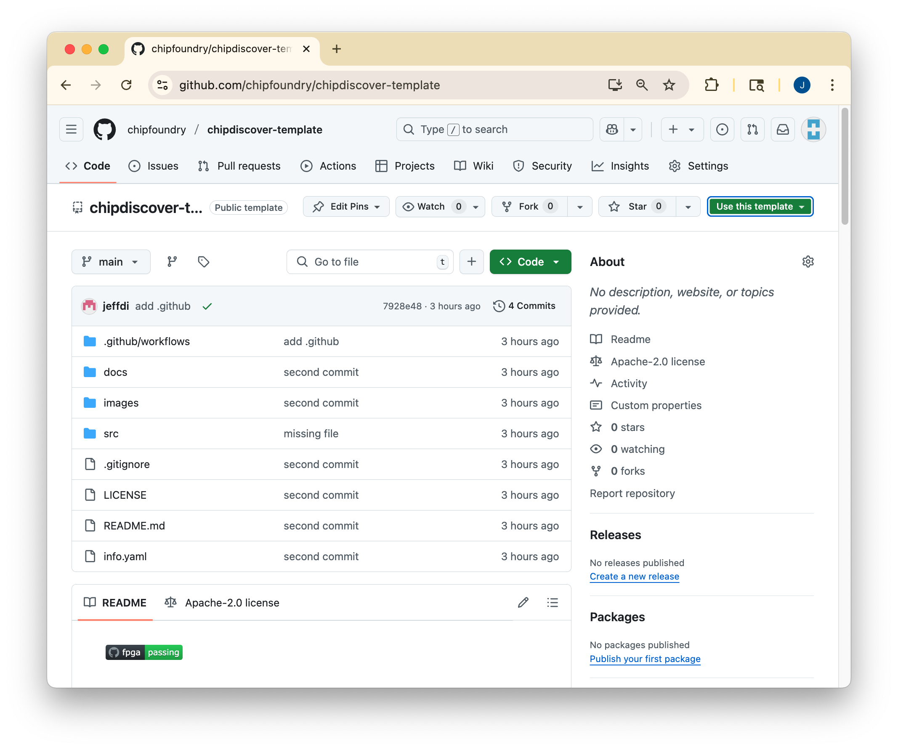
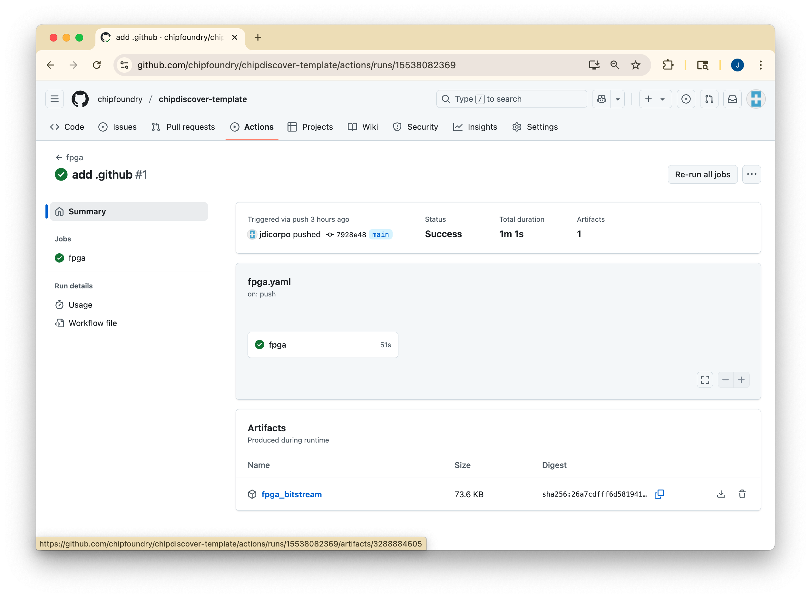
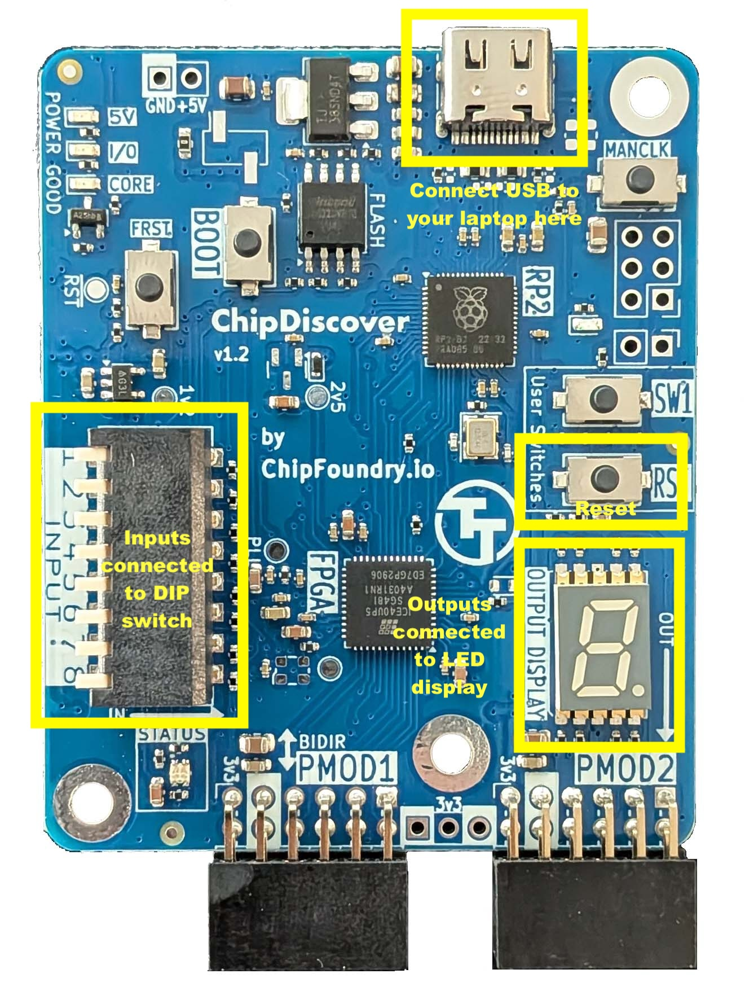

   

# ChipDiscover FPGA dev board

Learn to create digital designs and then get them fabricated on actual silicon using [Tiny Tapeout](https://tinytapeout.com) and [ChipFoundry](https://chipfoundry.io/)

- [Read the documentation for project](docs/info.md)

## Quick Start

### Step 1: create a project from using the Github template

Create a new project using the template.  You need to be logged into Github.  You should see a green button in the 
upper left.

### Step 2: updating settings for your project

On the pages tab of your project settings, changes the Source from 'Deploy from a branch' to 'GitHub Actions'.
This enables GitHub actions to run for your project which is required to generate the bitstream for the FPGA.

### Step 3: create your design

Use [wokwi](https://wokwi.com/) or Verilog to create a digital design.

### Step 4: edit the info.yaml

Edit the info.yaml file to specify all the fields.  Don't forget to set the *clock_hz* field to something appropriate for your design (pretty much anything between 10 and 40000000 Hz will be accepted).

### Step 5: push the changes

Commit your changes and push up to the repository.

### Step 6: get the UF2

Github actions will run on each commit, and you can find them under the actions tab.

Once the run is complete, click on the action and you'll find an `fpga_bitstream` zip file to download.

Grab that, unzip it, and within you'll find the `tt_fpga.uf2` file.  Copy that UF2 to the **FPGAUPDATE** drive.  The project should start running a few seconds later.

## FPGA dev board

The development boards will pop up the *FPGAUpdate* drive when they are plugged into USB.

These boards map well to Tiny Tapeout projects as they have:

  * 8 inputs, connected to the piano switch on the left, which map to `ui_in[7:0]`; 
  
  * 8 GPIO on PMOD1, similar to the bidirection PMOD on TT demoboards `uio_in/uio_out[7:0]`; and
  
  * 8 output IO, which go both to the 7-segment display and to PMOD2, which are the `uo_out[7:0]`

### Clocking

The project will, by default, be clocked at the rate you specified in the info.yaml (or as close as possible to that rate).  To enable single stepping ("manual" clocking), hold the switch on the top right (next to the USB port) and keep it held as you plug into USB.

Once it's powered-up, you may release the switch and then every press will clock the project once.

## What is Tiny Tapeout?

Tiny Tapeout is an educational project that aims to make it easier and cheaper than ever to get your digital and analog designs manufactured on a real chip.

To learn more and get started, visit https://tinytapeout.com.

## Resources

- [FAQ](https://tinytapeout.com/faq/)
- [Digital design lessons](https://tinytapeout.com/digital_design/)
- [Learn how semiconductors work](https://tinytapeout.com/siliwiz/)
- [Join the community](https://tinytapeout.com/discord)
- [Build your design locally](https://www.tinytapeout.com/guides/local-hardening/)
# chipdiscover-template
